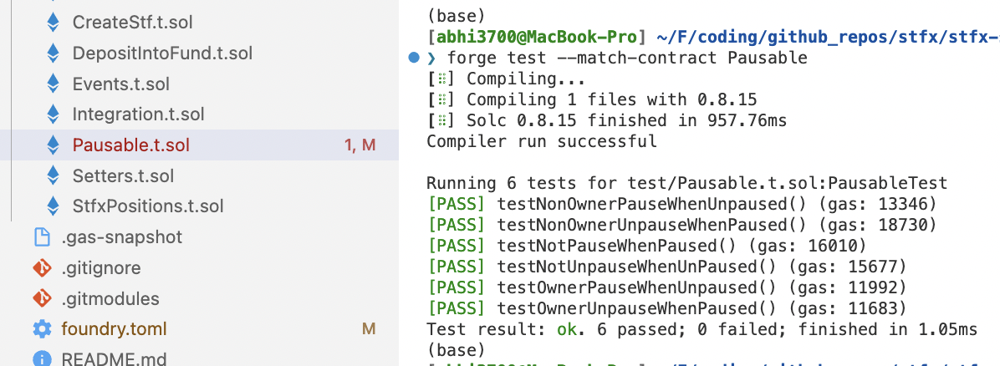
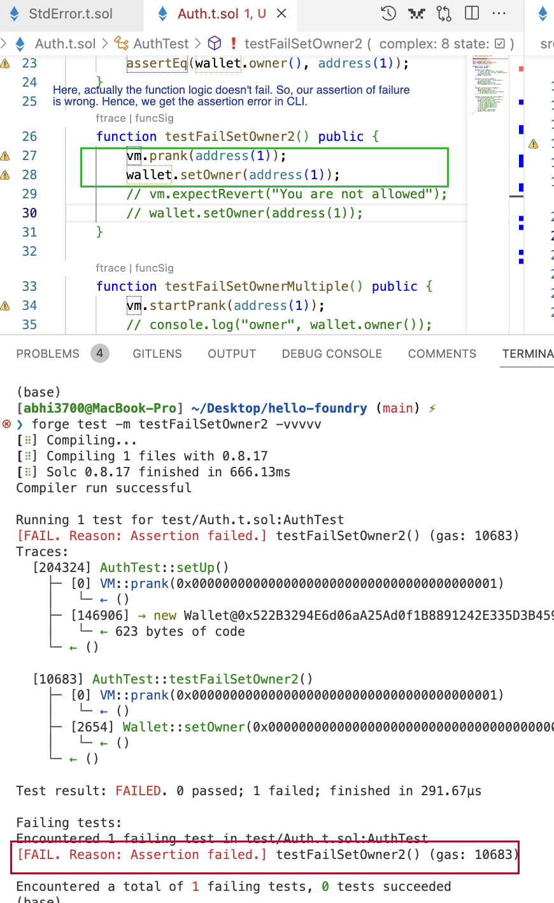
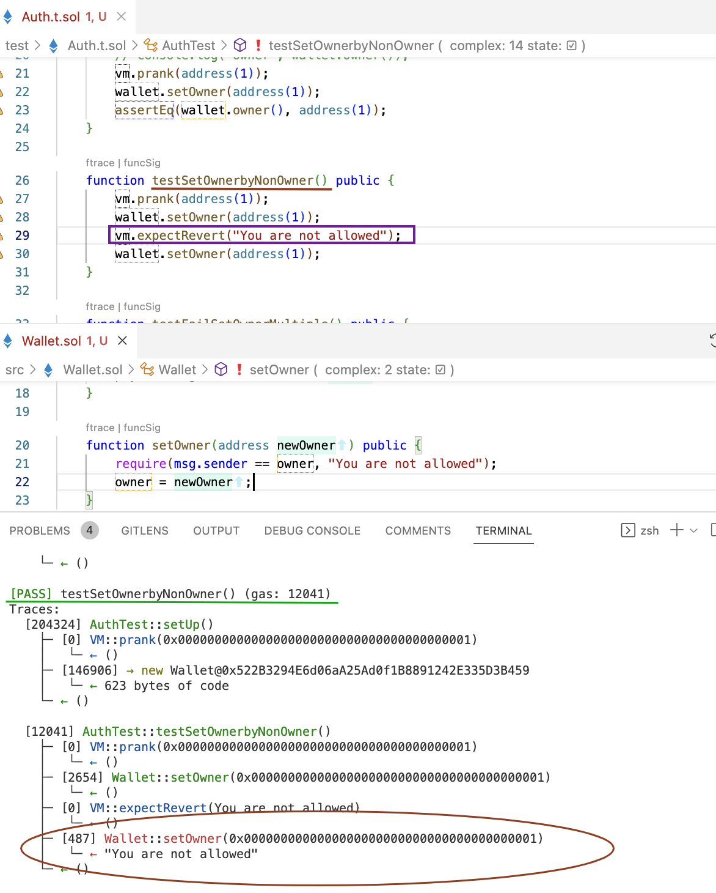
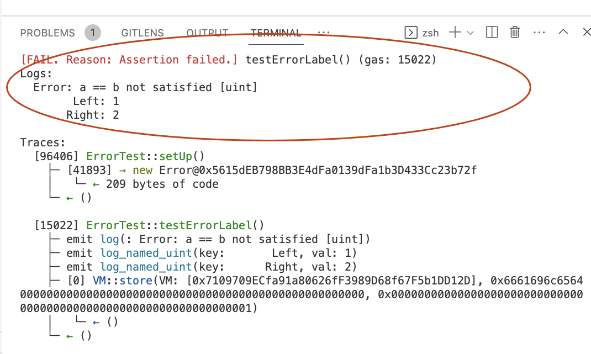
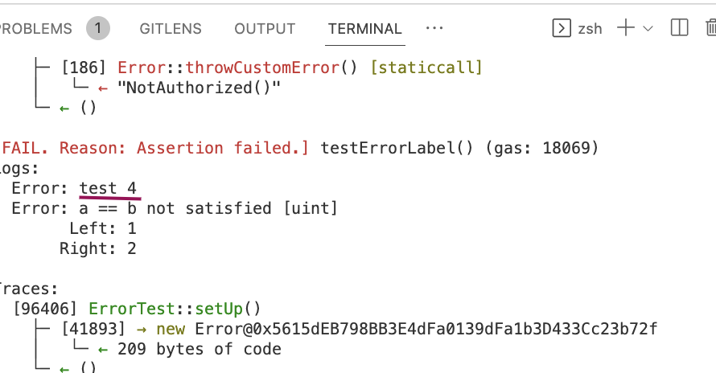
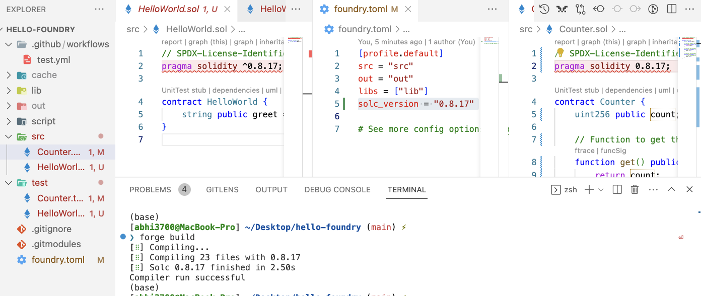
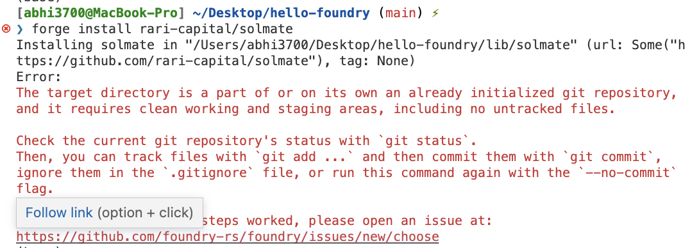
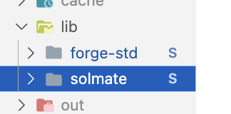
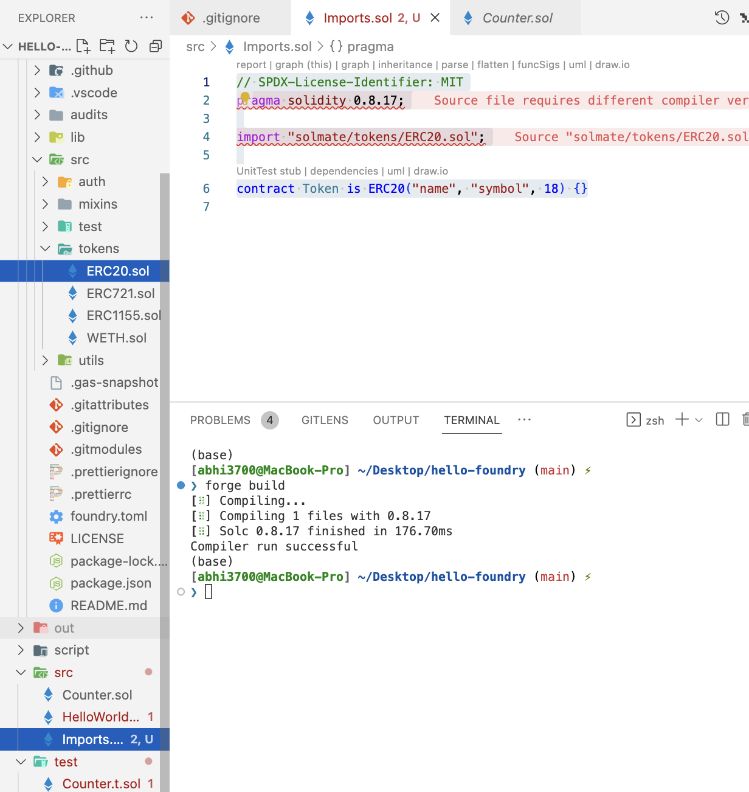
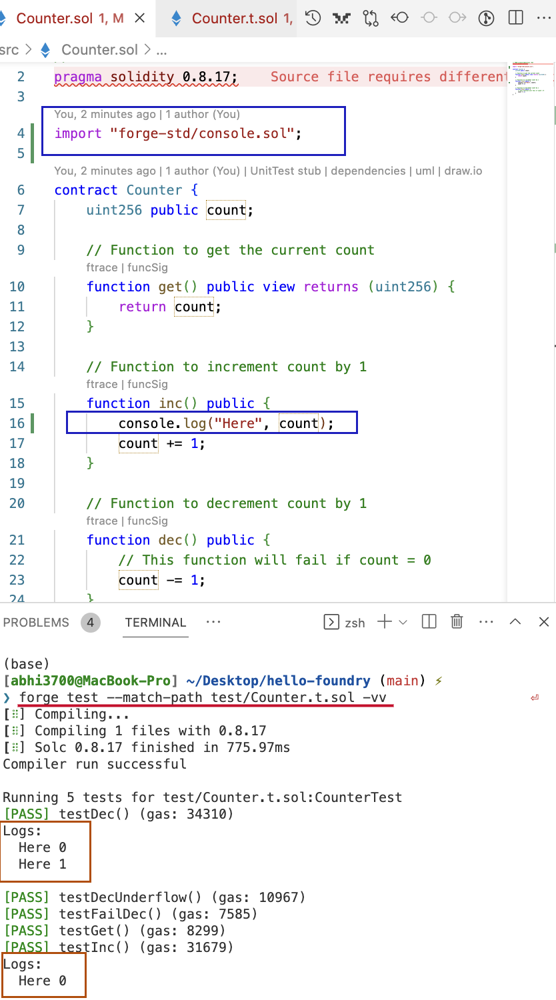

# Foundry

## About

Components:

- [`forge`](https://github.com/foundry-rs/foundry/tree/master/forge): CLI tool to tests, builds, and deploys your smart contracts.
- [`cast`](https://github.com/foundry-rs/foundry/tree/master/cast): to interact with the EVM chain & performing Ethereum RPC calls
- [`anvil`](https://github.com/foundry-rs/foundry/tree/master/anvil): to run a local node like Truffle's Ganache, Hardhat localnode.
- [`chisel`](https://github.com/foundry-rs/foundry/tree/master/chisel): REPL for Solidity. It allows to open a console and interact with the EVM chain (simulated) like `$ npx hardhat console`

## Installation

Following are the steps:

1. Install `foundryup`

```console
❯ curl -L https://foundry.paradigm.xyz | bash
  % Total    % Received % Xferd  Average Speed   Time    Time     Time  Current
                                Dload  Upload   Total   Spent    Left  Speed
  0     0    0     0    0     0      0      0 --:--:-- --:--:-- --:--:--     0
100  1765  100  1765    0     0   2236      0 --:--:-- --:--:-- --:--:--  2236
Installing foundryup...
######################################################################## 100.0%

Detected your preferred shell is zsh and added foundryup to PATH. Run 'source /Users/abhi3700/.zshrc' or start a new terminal session to use foundryup.
Then, simply run 'foundryup' to install Foundry.
```

2. Install `foundryup` tools: `forge`, `cast` and `anvil`, `chisel`

```console
❯ foundryup
foundryup: installing foundry (version nightly, tag nightly-92f8951409034fd597ad08a386474af8d2d8868a)
foundryup: downloading latest forge, cast and anvil
######################################################################### 100.0%
foundryup: downloading manpages
######################################################################### 100.0%
foundryup: installed - forge 0.2.0 (92f8951 2022-08-06T00:05:51.433929Z)
foundryup: installed - cast 0.2.0 (92f8951 2022-08-06T00:05:51.433929Z)
foundryup: installed - anvil 0.1.0 (92f8951 2022-08-06T00:05:51.822342Z)
foundryup: done
```

3. Update tools (if already installed)

```console
❯ foundryup
foundryup: installing foundry (version nightly, tag nightly-4a0c8dc4bb068839def6d230ebc38e0354fe7112)
foundryup: downloading latest forge, cast, anvil, and chisel
######################################################################### 100.0%
foundryup: downloading manpages
######################################################################### 100.0%
foundryup: installed - forge 0.2.0 (4a0c8dc 2023-04-15T00:04:40.457382000Z)
foundryup: installed - cast 0.2.0 (4a0c8dc 2023-04-15T00:04:40.457382000Z)
foundryup: installed - anvil 0.1.0 (4a0c8dc 2023-04-15T00:04:41.416294000Z)
foundryup: installed - chisel 0.1.1 (4a0c8dc 2023-04-15T00:04:41.578991000Z)
foundryup: done
```

## Editor

Use VSCode

Additionally, set the `contracts` folder as `src/` & package dependencies as `lib/` for Foundry.


---

Format the Solidity files using `$ forge fmt`.

## Getting Started

Refer [this](https://book.getfoundry.sh/getting-started/first-steps)

## Repositories

I have maintained the work [here](https://github.com/abhi3700/evm_contracts_foundry_1).

- https://github.com/EricForgy/foundry-hardhat-sample

## Create Project

- Create project folder with all dependency & config files.

```console
forge init --template https://github.com/foundry-rs/forge-template <project-name>
```

- Build: `$ forge build`
- Test: `$ forge test`

2 new folders are created:

- `out`: contains your contract artifact, such as the ABI
- `cache`: contains info to help `forge` recompile what is necessary.

## Commands

- `$ forge install` to install the libs used in `foundry.toml`.
- `$ forge build` to compile the contracts
- `$ forge test .... -vvvv` to look into the traces.

## Dependencies

In order to add more dependency lib, use like this:

```console
forge install OpenZeppelin/openzeppelin-contracts-upgradeable
```

> Just copy {owner/repo_name} from the actual repo url: https://github.com/OpenZeppelin/openzeppelin-contracts-upgradeable

Also add as submodule in `.gitmodules`

## Testing

### CLI via `forge`

Here is the color code in terminal for `forge` command:

```text
green: the function runs properly
red: the function fails
```

---

By default during testing, the function caller would be the testing contract itself i.e. `address(this)` i.e. `msg.sender`. So, in order to set an address, use `vm.prank(address(1))` for next immediate call & for next successive calls, use `vm.startPrank(address(1))` & then need to stop using `vm.stopPrank()`. This is useful when we want to test the contract with different addresses as caller (alice, bob, charlie, etc).

---

While importing the files, no need to use `../src` as the path is measured from root of the project like this:


There are different ways to view the details/traces during test (found via `$ forge help test` or `$ forge test --help`):


> Ideally 3 to 4 levels of verbosity is enough.

---

`$ forge test -vv`

```console
[⠢] Compiling...
No files changed, compilation skipped

Running 2 tests for test/Contract.t.sol:ContractTest
[PASS] testGetCount() (gas: 7472)
[PASS] testIncrement() (gas: 11197)
Test result: ok. 2 passed; 0 failed; finished in 403.21µs
```

---

`$ forge test -vvvv` shows the traces

```console
[⠢] Compiling...
No files changed, compilation skipped

Running 2 tests for test/Contract.t.sol:ContractTest
[PASS] testGetCount() (gas: 7472)
Traces:
  [7472] ContractTest::testGetCount()
    ├─ [2261] Counter::count() [staticcall]
    │   └─ ← 10
    └─ ← ()

[PASS] testIncrement() (gas: 11197)
Traces:
  [11197] ContractTest::testIncrement()
    ├─ [5247] Counter::increment()
    │   └─ ← ()
    ├─ [261] Counter::count() [staticcall]
    │   └─ ← 11
    └─ ← ()

Test result: ok. 2 passed; 0 failed; finished in 279.50µs
```

---

To log (on console) a variable output, use `$ forge test -vv`

```solidity
function testGetCount() public {
  uint256 c = counter.count();
  assertEq(c, 10);
  emit log_named_uint("The value is: ", c);
}
```

---

In order to test the entire contract test file like `Pausable.t.sol` i.e. `$ forge test --match-contract Pausable`:



---

In order to test the functions named (with REGEX pattern) use like this:


---

One can test single function as well by providing the exact testfile's function name:

```console
❯ forge test -m testNonOwner
[⠆] Compiling...
No files changed, compilation skipped

Running 2 tests for test/Pausable.t.sol:PausableTest
[PASS] testNonOwnerPauseWhenUnpaused() (gas: 13346)
[PASS] testNonOwnerUnpauseWhenPaused() (gas: 18730)
Test result: ok. 2 passed; 0 failed; finished in 3.72ms
```

---

Run a particular test file like `$ forge test --match-path test/HelloWorld.t.sol -vvv`


### Test Function Naming

The function naming (a choice) in foundry is different than the usual way of naming in other frameworks like Hardhat, Truffle, Brownie, etc.

> It's a good practice to name your function starting with `test`. This is to isolate the test functions in a foundry project as the entire repo would be in solidity language.

There are 2 ways to name the functions in foundry:

**M-1**:

Here, in order to create a test function that fails, **we need to use `testFail`** prefix & also ensure that the function fails, otherwise we get `AssertionError` like this:



And then when applied correct logic inside that function, there is no assertion error as shown below:


> Please note that `vm.expectRevert()` is not used here, otherwise there would be assertion error in console.

---

**M-2**:

Here, in order to create a test function that fails, **we don't need** to follow any naming pattern. But, we have to then use `vm.expectRevert()` just before the function call which is going to fail.



### Revert

For a contract function like this:

```solidity
function throwError() external pure {
    require(false, "not authorized");
}
```

we can use the revert function (in foundry) for **M-2** (described above) as shown below:

- `vm.expectRevert()` is used to check if the function call is going to revert or not.
- `vm.expectRevert(bytes("onlyOwner"))` is used to check if the function call is going to revert with the exact revert message or not.

```solidity
function testRevert() public {
    vm.expectRevert();  // NOTE
    error.throwError();
}

function testRequireMessage() public {
    vm.expectRevert(bytes("not authorized")); // NOTE
    error.throwError();
}
```

---

Similarly, for a contract function with custom error defined using `error` keyword like this:

```solidity
error NotAuthorized();

function throwCustomError() external pure {

    revert NotAuthorized();

}
```

we can use the revert function (in foundry) for **M-2** (described above) as shown below:

```solidity
function testCustomError() public {
    vm.expectRevert(Error.NotAuthorized.selector);  // NOTE
    error.throwCustomError();
}
```

---

In order to consider testing arithmetic overflow/underflow, use like this:

```solidity
function testDecUnderflow() public {
    vm.expectRevert(stdError.arithmeticError);    // NOTE
    counter.dec();
}
```

---

**Assertion Error labels** are defined when the console error is not able to give more details:

**Before**:

`Contract.t.sol`:

```solidity
function testErrorLabel() public {
    assertEq(uint256(1), uint256(1));
    assertEq(uint256(1), uint256(1));
    assertEq(uint256(1), uint256(1));
    assertEq(uint256(1), uint256(2)); // suppose to fail
    assertEq(uint256(1), uint256(1));
}
```



used `-vvvv` for more info here. But, still not clear. Here, not able to detect which line is failing, as it's shown only Assertion Error.

**After**:

`Contract.t.sol`:

```solidity
function testErrorLabel() public {
    assertEq(uint256(1), uint256(1), "test 1");
    assertEq(uint256(1), uint256(1), "test 2");
    assertEq(uint256(1), uint256(1), "test 3");
    assertEq(uint256(1), uint256(2), "test 4"); // suppose to fail
    assertEq(uint256(1), uint256(1), "test 5");
}
```



used `-vvvv` for more info here. Now, it's clear which line is failing i.e. the line with "test 4" error label.

### Event

We have 3 steps to follow:

```solidity
function testEmitTransferEvent() public {
    // 1. tell foundry which data to check for
    // (index_check, index_check, index_check, rest_data_check)
    vm.expectEmit(true, true, false, true);

    // 2. emit the expected event
    emit Transfer(address(1), address(2), 100, bytes32("fun"));

    // 3. call the function that should emit the actual event
    e.transfer(address(1), address(2), 100, bytes32("fun"));
}
```

We also have the freedom to check the params independently the params & ignore the rest of the params.

For detailed example, refer [this](../../utils/foundry/test/Event.t.sol) for [contract](../../utils/foundry/src/Event.sol).

[Source](https://www.youtube.com/playlist?list=PLO5VPQH6OWdUrKEWPF07CSuVm3T99DQki)

### Fuzzy

Fuzz test basically means it'll randomly choose addresses and run the test 256 times by default.

if you want to make it run more than 256, you can change `fuzz_runs` on `foundry.toml` to any number you want like 1000, 5000 or even 50k, but it'll change for all the fuzz tests, not for a particular test file/function.

E.g:

**Before**:

```solidity
function testNonOwnerPauseWhenUnpaused() public {
  vm.startPrank(alice);
  vm.expectRevert("onlyOwner");
  vault.pause();
  vm.stopPrank();
}
```

**After**:

```solidity
function testNonOwnerPauseWhenUnpaused(address testAddress) public {
  vm.assume((testAddress != address(0)) && (testAddress != vault.owner()));
  vm.startPrank(testAddress);
  vm.expectRevert("onlyOwner");
  vault.pause();
  vm.stopPrank();
}
```

## Gas report

Just use the flag `--gas-report` for respective test functions (using `-m`, `--match-path`, `--match-contract`):

```console
$ forge test --match-path test/HelloWorld.t.sol -vvv --gas-report
```


## Solidity compiler version

Set the solidity compiler version for your contracts in project.

```toml
# just need to add this line in foundry.toml
solc_version = "0.8.17"
```



---

It is failing here because 1 of the contracts is using `0.8.17` and the other one is using `0.8.19`:

> All the contracts have to use the same version of solidity compiler as set in `foundry.toml` file.


## Optimizer

Set optimizer for your contracts in project.

```toml
optimizer = true
optimizer_runs = 200
```

Then, build using `$ forge build`.

## Remapping, Lib, Dependencies, Imports

Import Solidity libraries like **Solmate** and **Openzeppelin** into your Foundry project.

Error when installing lib using `$ forge install` because there were untracked/modified files in the project. So, ensure we have a clean slate i.e. `$ git status` should be clean:



---

Success when the `git status` is clean:


Also, the `solmate` folder is created inside `lib/` folder:



---

Then, we can import the `ERC20.sol` file from the Solmate library like this into our `Imports.sol` contract:



And then we can build the project using `$ forge build`

---

In order to see what dependencies (as libs) are being used in the project, use `$ forge remappings`:


---

- `$ forge update`: update all dependencies.
- `$ forge update <lib_path>`: update a specific dependency.
  - `$ forge update lib/solmate`: update the `solmate` lib.
  - `$ forge update lib/forge-std`: update the `forge-std` lib.
  - `ds-test` gets updated as soon as the `lib/forge-std` gets updated.
- `$ forge remove solmate`: remove the `solmate` lib.

---

After removing the `solmate` lib, the `Imports.sol` build would fail:


In order to fix this, we can reinstall the `solmate` lib using `$ forge install solmate`.

> Keep the `git status` clean before installing the lib.

And then, rebuild using `$ forge build`.

---

Next, we want to import a file from Openzeppelin contracts repo. So, we can install that using `$ npm i @openzeppelin/contracts`:


And then, we can import `Ownable.sol` file from the Openzeppelin contracts like this into our `Imports.sol` contract:

```solidity
import "@openzeppelin/contracts/access/Ownable.sol";

contract TestOz is Ownable {}
```

And then create a `remappings.txt` file & add this line:

```txt
@openzeppelin/=node_modules/@openzeppelin/
```

And then build using `$ forge build`.

Now, we can view the cumulative dependencies in the project using `$ forge remappings`:

```console
❯ forge remappings
@openzeppelin/=node_modules/@openzeppelin/
ds-test/=lib/forge-std/lib/ds-test/src/
forge-std/=lib/forge-std/src/
solmate/=lib/solmate/src/
```

## Formatting

- M-1: Format your Solidity code using `$ forge format`.
- M-2: In my editor (VSC), I have the solidity extensions installed. So, my code gets auto-formatted on save.
  - For this, all the used extensions can be synced as & when I login into my VSC account via Github.

> To save the code without formatting, use `cmd+k` + `cmd+s` (on Mac).

## Debuggging

In order to use `console.log()`, import this into your solidity file (contract, test, deploy scripts):

> Normally, `logInt()`, `logUint()` doesn't support 256 bit in `console.sol`, instead import `console.sol` for foundry only project. And for hardhat + foundry projects, use `forge-std/console.sol`.

```solidity
import "forge-std/console.sol";
```

Then, we get to test the file using `$ forge test --match-path test/Counter.t.sol -vv`:



---

We can do this for test file as well. For example, in `Counter.t.sol`.

---

Before deployment, ensure that all the console logs related code are removed from the contracts (may exist in the test files).

---

console log functions (most commonly used):

For more, refer this file: `forge-std/console.sol`

- `log(string memory message)`: log a message.
  ```solidity
  console.log("Hello World");
  console.log("Hello ", "World");
  console.log("Hello times ", 1);
  ```
- `logInt(int)`: log int value.
  ```solidity
  console.log(1);
  ```

## Deployment

Run a local node via `$ anvil`:

```console
❯ anvil


                             _   _
                            (_) | |
      __ _   _ __   __   __  _  | |
     / _` | | '_ \  \ \ / / | | | |
    | (_| | | | | |  \ V /  | | | |
     \__,_| |_| |_|   \_/   |_| |_|

    0.1.0 (92f8951 2022-08-06T00:05:51.822342Z)
    https://github.com/foundry-rs/foundry

Available Accounts
==================

(0) 0xf39fd6e51aad88f6f4ce6ab8827279cfffb92266 (10000 ETH)
(1) 0x70997970c51812dc3a010c7d01b50e0d17dc79c8 (10000 ETH)
(2) 0x3c44cdddb6a900fa2b585dd299e03d12fa4293bc (10000 ETH)
(3) 0x90f79bf6eb2c4f870365e785982e1f101e93b906 (10000 ETH)
(4) 0x15d34aaf54267db7d7c367839aaf71a00a2c6a65 (10000 ETH)
(5) 0x9965507d1a55bcc2695c58ba16fb37d819b0a4dc (10000 ETH)
(6) 0x976ea74026e726554db657fa54763abd0c3a0aa9 (10000 ETH)
(7) 0x14dc79964da2c08b23698b3d3cc7ca32193d9955 (10000 ETH)
(8) 0x23618e81e3f5cdf7f54c3d65f7fbc0abf5b21e8f (10000 ETH)
(9) 0xa0ee7a142d267c1f36714e4a8f75612f20a79720 (10000 ETH)

Private Keys
==================

(0) 0xac0974bec39a17e36ba4a6b4d238ff944bacb478cbed5efcae784d7bf4f2ff80
(1) 0x59c6995e998f97a5a0044966f0945389dc9e86dae88c7a8412f4603b6b78690d
(2) 0x5de4111afa1a4b94908f83103eb1f1706367c2e68ca870fc3fb9a804cdab365a
(3) 0x7c852118294e51e653712a81e05800f419141751be58f605c371e15141b007a6
(4) 0x47e179ec197488593b187f80a00eb0da91f1b9d0b13f8733639f19c30a34926a
(5) 0x8b3a350cf5c34c9194ca85829a2df0ec3153be0318b5e2d3348e872092edffba
(6) 0x92db14e403b83dfe3df233f83dfa3a0d7096f21ca9b0d6d6b8d88b2b4ec1564e
(7) 0x4bbbf85ce3377467afe5d46f804f221813b2bb87f24d81f60f1fcdbf7cbf4356
(8) 0xdbda1821b80551c9d65939329250298aa3472ba22feea921c0cf5d620ea67b97
(9) 0x2a871d0798f97d79848a013d4936a73bf4cc922c825d33c1cf7073dff6d409c6

Wallet
==================
Mnemonic:          test test test test test test test test test test test junk
Derivation path:   m/44'/60'/0'/0/


Base Fee
==================

1000000000

Gas Limit
==================

30000000

Listening on 127.0.0.1:8545
```

---

Run SIMULATION to estimate the gas cost to deploy the contract

```console
❯ forge script script/Contract.s.sol:ContractScript --fork-url http://localhost:8545 --private-key 0xac0974bec39a17e36ba4a6b4d238ff944bacb478cbed5efcae784d7bf4f2ff80
[⠢] Compiling...
No files changed, compilation skipped
Script ran successfully.

==========================

Estimated total gas used for script: 170710

Estimated amount required: 0.00085355 ETH

==========================

SIMULATION COMPLETE. To broadcast these transactions, add --broadcast and wallet configuration(s) to the previous command. See forge script --help for more.

Transactions saved to: broadcast/Contract.s.sol/31337/run-latest.json
```

---

Run this to broadcast the transaction

```console
❯ forge script script/Contract.s.sol:ContractScript --fork-url http://localhost:8545 --private-key 0xac0974bec39a17e36ba4a6b4d238ff944bacb478cbed5efcae784d7bf4f2ff80 --broadcast
[⠢] Compiling...
No files changed, compilation skipped
Script ran successfully.

==========================

Estimated total gas used for script: 170710

Estimated amount required: 0.00085355 ETH

==========================

###
Finding wallets for all the necessary addresses...
##
Sending transactions [0 - 0].
⠁ [00:00:00] [##################################] 1/1 txes (0.0s)
Transactions saved to: broadcast/Contract.s.sol/31337/run-latest.json

##
Waiting for receipts.
⠉ [00:00:00] [##############################] 1/1 receipts (0.0s)
#####
✅ Hash: 0x4608c98102dcdfbe2e4c8f268f0c77bad139027e8e347aa8324ecebc649d9a3b
Contract Address: 0x5fbdb2315678afecb367f032d93f642f64180aa3
Block: 1
Paid: 0.0005089931990988 ETH (131316 gas * 3.8760943 gwei)


Transactions saved to: broadcast/Contract.s.sol/31337/run-latest.json


==========================

ONCHAIN EXECUTION COMPLETE & SUCCESSFUL. Transaction receipts written to "broadcast/Contract.s.sol/31337/run-latest.json"

Transactions saved to: broadcast/Contract.s.sol/31337/run-latest.json
```

## Interaction with Contract

Use `cast` tool to interact with

**get function**

```console
❯ cast call 0x5fbdb2315678afecb367f032d93f642f64180aa3 "count()(uint)"
10
```

---

**set function**

To increment the count via `increment()`

```console
❯ cast send 0x5fbdb2315678afecb367f032d93f642f64180aa3 "increment()" --private-key $PRIVATE_KEY

blockHash               0xcc0b40fd1e02027d37c59664ae73ec5dfd44d238a54ea889e5f011750949d183
blockNumber             2
contractAddress
cumulativeGasUsed       26311
effectiveGasPrice       3766774603
gasUsed                 26311
logs                    []
logsBloom               0x00000000000000000000000000000000000000000000000000000000000000000000000000000000000000000000000000000000000000000000000000000000000000000000000000000000000000000000000000000000000000000000000000000000000000000000000000000000000000000000000000000000000000000000000000000000000000000000000000000000000000000000000000000000000000000000000000000000000000000000000000000000000000000000000000000000000000000000000000000000000000000000000000000000000000000000000000000000000000000000000000000000000000000000000000000000
root
status                  1
transactionHash         0xfa3250b9aebcceba276b52a8939c9036982114f3f5c07d45c08b4e715c1e669b
transactionIndex        0
type
```

To decrement the count via `decrement()`

```console
❯ cast send 0x5fbdb2315678afecb367f032d93f642f64180aa3 "decrement()" --private-key $PRIVATE_KEY

blockHash               0x1f7e29a722f7dddec48993cb4493b748d03536844394f172c16e4e026f8a7d3e
blockNumber             3
contractAddress
cumulativeGasUsed       26286
effectiveGasPrice       3671095739
gasUsed                 26286
logs                    []
logsBloom               0x00000000000000000000000000000000000000000000000000000000000000000000000000000000000000000000000000000000000000000000000000000000000000000000000000000000000000000000000000000000000000000000000000000000000000000000000000000000000000000000000000000000000000000000000000000000000000000000000000000000000000000000000000000000000000000000000000000000000000000000000000000000000000000000000000000000000000000000000000000000000000000000000000000000000000000000000000000000000000000000000000000000000000000000000000000000
root
status                  1
transactionHash         0x95fe234128f9078e22f9bf082c0b80732aee665405f68a8680b5964a8eb31376
transactionIndex        0
type
```

## Code snippets

More can be found [here](../../utils/foundry/)

## Troubleshoot

### 1. Error: "solc": No such file or directory (os error 2)

- _Cause_: `solc` is set to false
- _Solution_: set `auto_detect_solc` to `true` in `foundry.toml`

### 2. FAIL. Reason: Call did not revert as expected Counterexample: calldata=


- _Cause_: so what that means is, basically, on the 150th run, the fuzzer chose the test contract's address itself.
- _Solution_: since that's the owner, it actually didn't revert back. so you can add another assumption and mention `vm.assume(testAddress != address(this))`;

Before:

```solidity
function testNonOwnerPauseWhenUnpaused(address testAddress) public {
  vm.assume(testAddress != address(0));

  vm.startPrank(testAddress);
  vm.expectRevert("onlyOwner");
  vault.pause();
  vm.stopPrank();
}
```

After:

```solidity
function testNonOwnerPauseWhenUnpaused(address testAddress) public {
  vm.assume((testAddress != address(0)) && (testAddress != vault.owner()));

  vm.startPrank(testAddress);
  vm.expectRevert("onlyOwner");
  vault.pause();
  vm.stopPrank();
}
```

### 3. Blank `solc error:` during `$ forge build`

- _Solution_:

1. `$ rm -rf ~/.svm`
2. `$ brew install z3`
3. `$ forge build`

### 4. Compilation error related to `ds-test` lib installation while running hardhat into Foundry project

- _Cause_: `ds-test` lib is missing

Error:

```console
❯ yarn compile
yarn run v1.22.17
warning ../../../../../package.json: No license field
$ hardhat compile
Error HH411: The library ds-test, imported from lib/forge-std/src/Test.sol, is not installed. Try installing it using npm.

For more info go to https://hardhat.org/HH411 or run Hardhat with --show-stack-traces
error Command failed with exit code 1.
info Visit https://yarnpkg.com/en/docs/cli/run for documentation about this command.
```

- _Solution_: Just add this line into `remappings.txt` file

```
ds-test/=lib/forge-std/lib/ds-test/src/
```

### 5. Assertion failure with `assertApproxEqAbs`

- _Cause_: It's going to fail most of the times.
- _Solution_: Leave the code as is. Or try changing the delta by increasing or decreasing.

### 6. Dependency installation error

- _Cause_: the `git status` is not clean i.e. need to commit the changes.
- _Solution_: commit the changes and then run `$ forge install <package-name-as-in-github>` like `$ forge install rari-capital/solmate`

## References

- [Smart Contract Development with Foundry | Nader Dabit](https://www.youtube.com/watch?v=uelA2U9TbgM)
