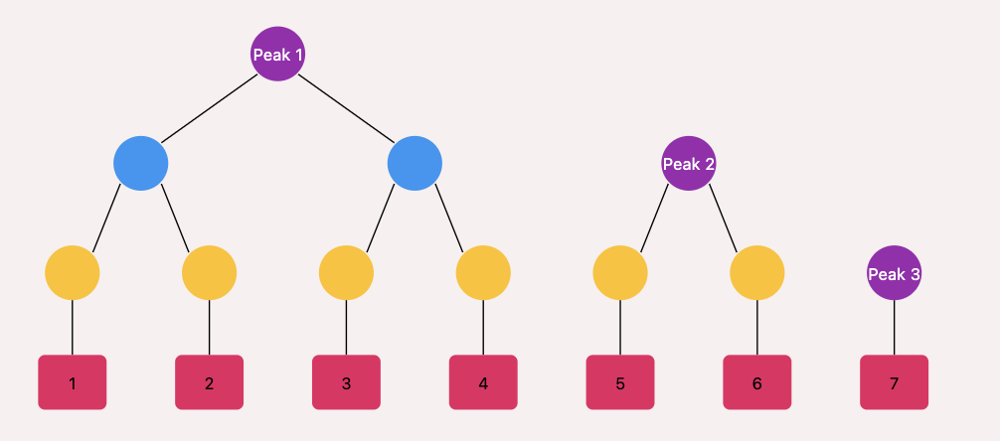

# EVM Research

## MEV

MEV protection layer on top of Ethereum would be a way to protect the Ethereum network from MEV attacks like front-running, sandwitch and tx reordering (by miners). The waiting txs in mempool are exploited by MEV bots.
> Mempool is inevitable in a blockchain. Otherwise, txs sent to RPCs by sender might not be available to all validators.

Details [here](https://www.notion.so/PBS-on-Ethereum-8408f202504f4196b78905676833c5c6)

Diagrams [here](../evm.drawio) tab: "MEV".

## L2 scaling

This is about channels, rollups (ZK, Optimistic), and sharding.

My notes on

- [ZK rollups](https://www.notion.so/ZK-Rollups-8ebd9daa4550472db8ae6405ae68f678?pvs=4).
- [Rollups](https://www.notion.so/Rollups-3acd65c9f37a46f692ae31818e0680d1?pvs=4)
  - covers all kinds of rollups.

## Mountain Merkle Tree (MMT)

MMT has multiple roots (or peaks). Looks like this:

In this new data entry appending is very fast (O(log(n))), but it consumes a lot of storage. Unlike Merkle tree, during verification of a leaf's integrity, we don't need all the leaves, rather it can be verified to it peak.

<b>Use cases:</b>

Excellent question. The Mountain Merkle Tree, with its unique structure of multiple peaks, has several important use cases, particularly in distributed systems and blockchain technology. Let's explore some key applications while referencing the diagram:

1. Blockchain Light Clients:
   - Use Case: Allowing lightweight verification of blockchain state without downloading the entire chain.
   - How it Works: Light clients can verify transactions or state changes by checking against the peaks, rather than the entire tree. This significantly reduces the amount of data needed for verification.

2. Append-Only Logs in Distributed Systems:
   - Use Case: Efficiently managing and verifying continuously growing logs.
   - How it Works: As new log entries (represented by the leaves 1-7 in our diagram) are added, only the rightmost peak(s) need to be updated. This makes appending new data very efficient.

3. Version Control Systems:
   - Use Case: Tracking file changes in distributed version control systems.
   - How it Works: Each commit could be represented as a leaf. The multiple peaks allow for efficient comparison and merging of different branches.

4. Certificate Transparency Logs:
   - Use Case: Maintaining an append-only log of SSL/TLS certificates.
   - How it Works: New certificates are added as leaves. The multiple peaks allow for efficient proof of inclusion without rebuilding the entire tree.

5. Distributed Databases:
   - Use Case: Ensuring data integrity and consistency across distributed nodes.
   - How it Works: Each data entry is a leaf. Nodes can efficiently compare their data states by just comparing the peaks.

6. Peer-to-Peer File Sharing:
   - Use Case: Verifying the integrity of large files in P2P networks.
   - How it Works: File chunks are leaves. Peers can verify parts of the file by checking against relevant peaks without needing the entire file.

7. Event Sourcing in Microservices:
   - Use Case: Maintaining a verifiable log of events in a microservices architecture.
   - How it Works: Each event is a leaf. Services can efficiently verify and sync their event logs using the peak structure.

8. Audit Trails:
   - Use Case: Creating tamper-evident logs for auditing purposes.
   - How it Works: Each audit entry is a leaf. The multiple peaks allow for efficient verification of the audit trail's integrity at any point.

9. Incremental Backup Systems:
   - Use Case: Efficiently managing and verifying incremental backups.
   - How it Works: Each backup increment is a leaf. The tree structure allows for quick verification of backup integrity and efficient updates.

In all these use cases, the key advantages of the Mountain Merkle Tree structure are:

1. Efficient Appends: Adding new data (leaves) only requires updating the rightmost part of the tree.
2. Compact Proofs: Proving the inclusion of any leaf requires only the path to its peak and the values of the other peaks.
3. Flexible Size: It can handle any number of leaves efficiently, not just powers of 2.
4. Incremental Verification: Parts of the data can be verified without processing the entire dataset.

These properties make Mountain Merkle Trees particularly useful in scenarios where data is frequently appended, needs to be efficiently verified, and where lightweight clients or partial data verification is important.
