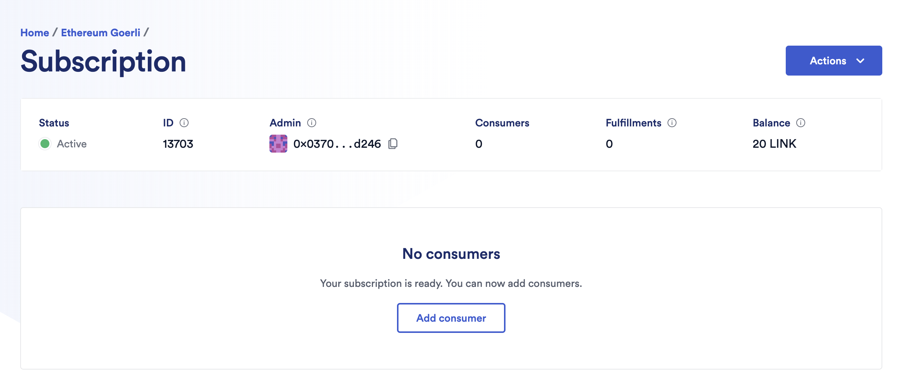
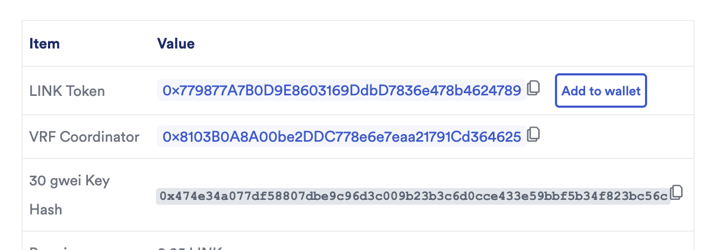

# Chainlink VRF

## Overview

It is based on the [Chainlink VRF specification](https://docs.chain.link/docs/chainlink-vrf/).

Current version is v2 for chainlink contracts.

## Prerequisites

> For Sepolia testnet. Unfortunately, for goerli testnet it is not working.

1. **Create subscription** (if doesn't exist for the network) from [subscription manager](https://vrf.chain.link/sepolia). For SepoliaETH tokens, get your faucet from [here](https://sepoliafaucet.com/).
   - View your subscription [here](https://vrf.chain.link/sepolia)
     
2. **Add Fund to the subscription ID**. Get LINK from [faucet](https://faucets.chain.link). Basically, the `VRFCoordinator.sol` contract is funded with sent LINK token. After funding, it looks like this.
   
3. Add funded subscription_id to the `VRFv2Consumer.sol` contract deployed by the contract as owner.
4. **Add consumer** (contract) address to the subscription ID. It looks like this:
   

For Sepolia testnet, details are here:

- **VRFCoordinatorV2.sol**: `0x8103B0A8A00be2DDC778e6e7eaa21791Cd364625`
- **LINK token**: `0x779877A7B0D9E8603169DdbD7836e478b4624789`

## Getting started

> NOTE: These parameters are important to change in a contract for different networks.
> 

1. Create a Consumer SC. Follow [this](../../sc-sol-foundry/src/RandomNumber.sol) example.
2. Deploy the Consumer SC using foundry [script](../../sc-sol-foundry/scripts/RandomNumber.s.sol) example using:

   <details><summary>View CLI details</summary>

   ```sh
   ❯ forge script script/RandomNumber.s.sol:RandomNumberScript --rpc-url $SEPOLIA_URL --private-key $DEPLOYER_PRIVATE_KEY --broadcast
   [⠰] Compiling...
   No files changed, compilation skipped
   Script ran successfully.

   == Logs ==
   contract: 0xd82732a4CB67cF8C92D7d70A5eaA7fbED84d3703

   ## Setting up (1) EVMs.

   ==========================

   Chain 11155111

   Estimated gas price: 5.016932426 gwei

   Estimated total gas used for script: 1031275

   Estimated amount required: 0.00517383698762315 ETH

   ==========================

   ###

   Finding wallets for all the necessary addresses...

   ##

   Sending transactions [0 - 0].
   ⠁ [00:00:00] [#############################################################################################################################] 1/1 txes (0.0s)
   Transactions saved to: /Users/abhi3700/F/coding/github_repos/evm_playground/sc-sol-foundry/broadcast/RandomNumber.s.sol/11155111/run-latest.json

   Sensitive values saved to: /Users/abhi3700/F/coding/github_repos/evm_playground/sc-sol-foundry/cache/RandomNumber.s.sol/11155111/run-latest.json

   ##

   Waiting for receipts.
   ⠉ [00:00:39] [################################] 1/1 receipts (0.0s)

   ##### sepolia

   ```

   </details>

3. Add consumer SC into the subscription ID which is managed by VRF Coordinator SC (deployed on respective chains).
4. Call `requestRandomness()` method from the consumer SC. It will return a requestId.

   <details><summary>View CLI details</summary>

   ```sh
   ❯ cast send $CONTRACT "requestRandomWords()(uint256)" --rpc-url $SEPOLIA_RPC_URL --private-key $DEPLOYER_PRIVATE_KEY

   blockHash               0xe677a99fc249c815afac6597b7472868ac76551856b6acd40e987cb5bddc495e
   blockNumber             4100955
   contractAddress
   cumulativeGasUsed       1266470
   effectiveGasPrice       5023320150
   gasUsed                 162610
   logs                    [{"address":"0x8103b0a8a00be2ddc778e6e7eaa21791cd364625","topics":["0x63373d1c4696214b898952999c9aaec57dac1ee2723cec59bea6888f489a9772","0x474e34a077df58807dbe9c96d3c009b23b3c6d0cce433e59bbf5b34f823bc56c","0x00000000000000000000000000000000000000000000000000000000000011d2","0x000000000000000000000000d82732a4cb67cf8c92d7d70a5eaa7fbed84d3703"],"data":"0x361adb5e7befa3247345ce971c81b627e2dcb2b2267e3bfd02fb1ec18be16e7e98ee6371feae247154bc708477a7a988a5bf423553bcf466e0df465de884f9a1000000000000000000000000000000000000000000000000000000000000000300000000000000000000000000000000000000000000000000000000000186a00000000000000000000000000000000000000000000000000000000000000002","blockHash":"0xe677a99fc249c815afac6597b7472868ac76551856b6acd40e987cb5bddc495e","blockNumber":"0x3e935b","transactionHash":"0x113564979500f741851f08dbda51ba034ea94c322f4e91cf7d36f2b43e8d9c73","transactionIndex":"0x6","logIndex":"0xd","removed":false},{"address":"0xd82732a4cb67cf8c92d7d70a5eaa7fbed84d3703","topics":["0xcc58b13ad3eab50626c6a6300b1d139cd6ebb1688a7cced9461c2f7e762665ee"],"data":"0x361adb5e7befa3247345ce971c81b627e2dcb2b2267e3bfd02fb1ec18be16e7e0000000000000000000000000000000000000000000000000000000000000002","blockHash":"0xe677a99fc249c815afac6597b7472868ac76551856b6acd40e987cb5bddc495e","blockNumber":"0x3e935b","transactionHash":"0x113564979500f741851f08dbda51ba034ea94c322f4e91cf7d36f2b43e8d9c73","transactionIndex":"0x6","logIndex":"0xe","removed":false}]
   logsBloom               0x0200000000000800010000000000000000000000000000000000000000000000000000000010000000000000000000000000000000000000000000000000000000000000000000000000000000000000000000000000000000000000000000000000000000000000000000000000000000000000000100000000000000200000000800000c000020001000000000000000000000000000000000000000000000000000000040000000000008000000000000000000000000000000000000000000000000020000000000080000008000000000000000000000000000000000000008000000000000000100000000000000000080000000800000000400000000
   root
   status                  1
   transactionHash         0x113564979500f741851f08dbda51ba034ea94c322f4e91cf7d36f2b43e8d9c73
   transactionIndex        6
   type                    2
   ```

   </details>

5. Get the owner, last request ID, random no.s (2):

   ```sh
   ❯ cast call $CONTRACT "owner()(address)" --rpc-url $SEPOLIA_RPC_URL
   0x0370D871f1D4B256E753120221F3Be87A40bd246

   ❯ cast call $CONTRACT "lastRequestId()(uint256)" --rpc-url $SEPOLIA_RPC_URL
   24472345876917549742594089986533833514554703043236703338799570720925469994622

   ❯ cast call $CONTRACT "getRequestStatus(uint256)(bool,uint256[])" 24472345876917549742594089986533833514554703043236703338799570720925469994622 --rpc-url $SE
   POLIA_RPC_URL
   true
   [77239408634929244818284413030926925607624771786591790234671878624870055999441,107121686211826326389036137481345444293166266423379007228065664053677342144542]
   ```

This is how, the random no.s are generated.

Find all the contracts [here](https://github.com/smartcontractkit/chainlink/tree/develop/contracts/src/v0.8/vrf) for solidity v0.8+.

## Resources

- [List of chainlink VRF contracts for different networks](https://docs.chain.link/vrf/v2/direct-funding/supported-networks)
- [Chainlink github node repo](https://github.com/smartcontractkit/chainlink)
  - [Chainlink contracts](https://github.com/smartcontractkit/chainlink/tree/develop/contracts)
