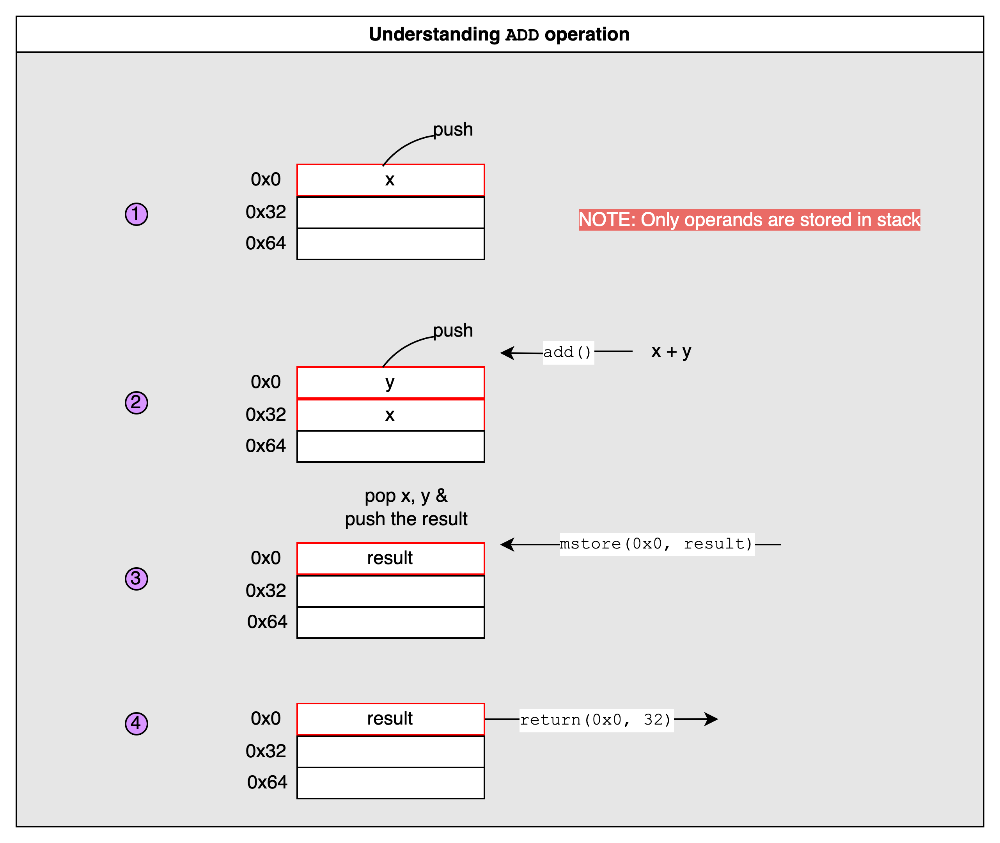

# Yul

## Concepts

**Motivation**:

Writing a simple Yul `increment()` function saves a gas cost of 200 gas compared to its solidity counterpart.

```solidity
// in pure solidity
function increment() public {
    count += 1;
}

// in yul
function increment() public {
    assembly {
        sstore(count.slot, add(sload(count.slot), 1))
    }
}
```

```sh
# test run via `foundry`
$ forge test --match-test testIncrement

sol: 13051
yul: 12851
```

---

All operands are stored on a stack.

---

**Opcodes basics**:

In order to be useful, a stack-machine need to implement additional instructions, like `ADD`, `SUBSTRACT`, etc… Instructions usually pop one or more values from the stack, do some computation, and push the result. This order is called **Reverse Polish Notation**.

```
a + b      // Standard Notation (Infix)
a b add    // Reverse Polish Notation
```

---

**Understanding `ADD` operation with stack & memory**:

```solidity
assembly {
    let result := add(x, y)
    mstore(0x0, result)
    return(0x0, 32)
}
```



---

**Comparo of `SUB` operation**:

Consider this code with/without using `z` (external (to assembly scope) local variable).

## Resources

- [Solidity Tutorial : all about Assembly](https://jeancvllr.medium.com/solidity-tutorial-all-about-assembly-5acdfefde05c)
